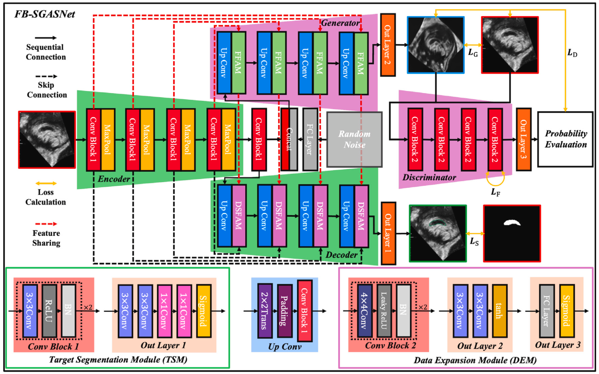

# FB-SGASNet: Semi-supervised Generative Adversarial Network for CCSP Segmentation

This repository presents the outcomes of the study:

> **"Integrated generation adversarial and semi-supervised network for Corpus Callosum and Cavum Septum Pellucidum Complex segmentation in fetal brain ultrasound via progressive training"**  
> *Qifeng Wang, Dan Zhao, Hao Ma, Xiangjun Yang, Bin Liu*  
> Published in **Applied Soft Computing**, 2025.  
> DOI: [10.1016/j.asoc.2025.112767](https://doi.org/10.1016/j.asoc.2025.112767)

---

## Overview
FB-SGASNet is a progressive **semi-supervised generative adversarial segmentation network** designed for accurate and robust segmentation of the **Corpus Callosum and Cavum Septum Pellucidum Complex (CCSP)** in **fetal brain mid-sagittal ultrasound (FBMS)** images, addressing challenges from **limited labeled data** and **high variability** across gestational ages.
- **Progressive training**

- **Network**


Key innovations:
- **Target Segmentation Module (TSM)** + **Data Expansion Module (DEM)** for joint learning.
- **Feature Fusion Attention Module (FFAM)** and **Dual-Stream Feature Attention Module (DSFAM)** to refine anatomical features.
- **Progressive training** to stabilize convergence and improve generalization:
  - **Step 1 – Separate Training**: Train TSM (segmentation) and DEM (generation) independently to learn basic features.
  - **Step 2 – Fusion Training**: Integrate TSM and DEM with attention modules (FFAM & DSFAM) for joint optimization.
  - **Step 3 – Semi-supervised Fine-tuning**: Leverage unlabeled data via adversarial consistency loss and pseudo-label refinement.
- Trained on the **FB-CCSP Dataset** (200 real + 450 synthetic images, 18–32 weeks GA).

---

## Highlights
- Outperforms UNet, Swin-UNet, Attention UNet, and SAM on **Dice (0.8531)** and **IoU (0.7712)**.
- Demonstrates superior **stability** and **precision** compared to expert sonographers.
- Integrated into a **mobile CAD system** for clinical trials.

---

## Demonstration


---

## Citation

If you use this work, please cite:

```bibtex
@article{wang2025fbsgasnet,
  title={Integrated generation adversarial and semi-supervised network for Corpus Callosum and Cavum Septum Pellucidum Complex segmentation in fetal brain ultrasound via progressive training},
  author={Wang, Qifeng and Zhao, Dan and Ma, Hao and Yang, Xiangjun and Liu, Bin},
  journal={Applied Soft Computing},
  volume={171},
  pages={112767},
  year={2025},
  doi={10.1016/j.asoc.2025.112767}
}
```

---

## Contact
For **data requests, academic collaborations, or presentation materials**:  
- **Email**: [wqf970702@mail.dlut.edu.cn](mailto:wqf970702@mail.dlut.edu.cn)  
- **ResearchGate**: [Qifeng Wang](https://www.researchgate.net/profile/Qifeng-Wang-9?ev=hdr_xprf)
